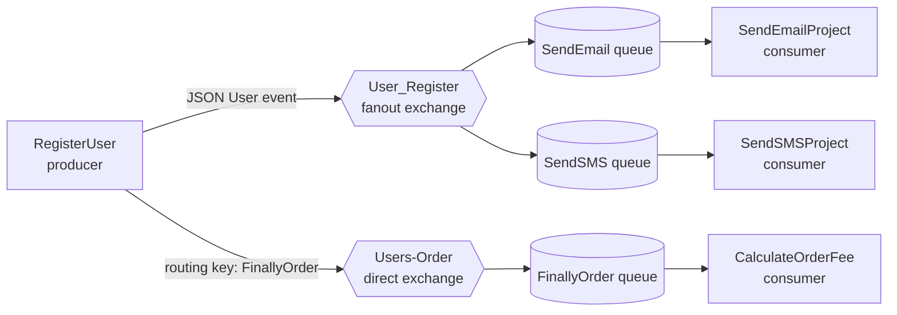

# RabbitMq

> A practical **.NET 10 / C#** messaging sample that demonstrates a user-registration event flowing through RabbitMQ to independent email, SMS, and order-fee consumers.

[](https://learn.microsoft.com/dotnet/csharp/)
[](https://dotnet.microsoft.com/)
[](https://www.rabbitmq.com/)

## Table of Contents

- [Overview](#overview)
- [What This Sample Demonstrates](#what-this-sample-demonstrates)
- [Architecture and Message Flow](#architecture-and-message-flow)
- [Projects](#projects)
- [Technology Stack](#technology-stack)
- [Prerequisites](#prerequisites)
- [Quick Start](#quick-start)
- [RabbitMQ Topology](#rabbitmq-topology)
- [Message Contract](#message-contract)
- [Configuration](#configuration)
- [Expected Output](#expected-output)
- [Development](#development)
- [Current Scope and Production Considerations](#current-scope-and-production-considerations)
- [License](#license)
- [Author](#author)

## Overview

**RabbitMq** is a small, console-based reference project for learning RabbitMQ with the official .NET client. A registration command collects a user's phone number and email address, serializes the data as JSON, and publishes it through two messaging patterns:

1. **Publish/subscribe** — a fanout exchange broadcasts the registration event to the email and SMS services.
2. **Point-to-point routing** — a direct exchange routes the same payload to the order-fee service through a dedicated queue.

Each consumer is an independent executable. This separation makes the sample useful for understanding how a broker decouples producers from downstream services.

## What This Sample Demonstrates

- Creating asynchronous RabbitMQ connections and channels with `RabbitMQ.Client`
- Declaring durable exchanges and queues
- Publishing UTF-8 JSON messages
- Broadcasting an event with a **fanout exchange**
- Routing a message with a **direct exchange** and routing key
- Consuming messages asynchronously with `AsyncEventingBasicConsumer`
- Acknowledging each successfully handled message manually
- Sharing a simple message contract across console applications

## Architecture and Message Flow



### End-to-end sequence

1. `RegisterUser` asks for a phone number and email address.
2. It creates a `User` object and serializes it to JSON.
3. The payload is published to the `User_Register` fanout exchange. RabbitMQ delivers a copy to both `SendEmail` and `SendSMS` queues.
4. The same payload is published to the `Users-Order` direct exchange with the `FinallyOrder` routing key. RabbitMQ routes it to the `FinallyOrder` queue.
5. `SendEmailProject`, `SendSMSProject`, and `CalculateOrderFee` each consume their own message and write the simulated action to the console.
6. Every consumer sends a manual acknowledgement after processing its delivery.

## Projects

| Project | Role | Responsibility |
| --- | --- | --- |
| [`RegisterUser`](RegisterUser/) | Producer | Reads registration data from the console and publishes the JSON payload to the fanout and direct exchanges. |
| [`SendEmailProject`](SendEmailProject/) | Consumer | Receives fanout events from the `SendEmail` queue and simulates sending an email. |
| [`SendSMSProject`](SendSMSProject/) | Consumer | Receives fanout events from the `SendSMS` queue and simulates sending an SMS. |
| [`CalculateOrderFee`](CalculateOrderFee/) | Consumer | Receives direct-routed messages from the `FinallyOrder` queue and simulates order-fee handling. |
| [`Util`](Util/) | Shared library | Defines the shared `User` message contract used by all executables. |

The solution file is [`RabbitMq.slnx`](RabbitMq.slnx).

## Technology Stack

| Technology | Purpose |
| --- | --- |
| [C#](https://learn.microsoft.com/dotnet/csharp/) | Application language |
| [.NET 10](https://dotnet.microsoft.com/) | Target framework for all projects |
| [RabbitMQ](https://www.rabbitmq.com/) | AMQP message broker |
| [`RabbitMQ.Client` 7.2.1](https://www.nuget.org/packages/RabbitMQ.Client/7.2.1) | Official RabbitMQ .NET client |
| [`Newtonsoft.Json` 13.0.4](https://www.nuget.org/packages/Newtonsoft.Json/13.0.4) | JSON serialization and deserialization |

## Prerequisites

Before running the sample, install or have access to:

- The [.NET 10 SDK](https://dotnet.microsoft.com/download)
- A running [RabbitMQ](https://www.rabbitmq.com/download.html) instance
- Optional: [Docker](https://www.docker.com/) for a local RabbitMQ broker

The applications use RabbitMQ's local default connection details:

| Setting | Value |
| --- | --- |
| Host | `localhost` |
| Port | `5672` |
| Username | `guest` |
| Password | `guest` |

> **Note:** RabbitMQ restricts the default `guest` account to local connections. These defaults are appropriate for local learning only; use a dedicated, least-privilege account and secure configuration in deployed environments.

## Quick Start

### 1. Clone the repository

```bash
git clone https://github.com/MohammadHasanp/RabbitMq.git
cd RabbitMq
```

### 2. Start RabbitMQ

If RabbitMQ is not already available locally, start it with the management plugin enabled:

```bash
docker run -d \
  --name rabbitmq \
  -p 5672:5672 \
  -p 15672:15672 \
  rabbitmq:3-management
```

The management dashboard will be available at [http://localhost:15672](http://localhost:15672). Sign in locally with `guest` / `guest`.

### 3. Restore and build

```bash
dotnet restore RabbitMq.slnx
dotnet build RabbitMq.slnx
```

### 4. Start the consumers

Open **three terminals** and keep each consumer running before sending a registration event:

```bash
# Terminal 1
dotnet run --project SendEmailProject/SendEmailProject.csproj
```

```bash
# Terminal 2
dotnet run --project SendSMSProject/SendSMSProject.csproj
```

```bash
# Terminal 3
dotnet run --project CalculateOrderFee/CalculateOrderFee.csproj
```

### 5. Start the producer

In a fourth terminal, run:

```bash
dotnet run --project RegisterUser/RegisterUser.csproj
```

Enter the requested phone number and email address. When prompted with `Send Again?`, enter `y` to publish another event or any other value to exit the publishing loop.

## RabbitMQ Topology

The topology is declared by the applications at startup. The exchanges and queues below are durable, so their definitions survive a broker restart.

| Type | Name | Durable | Binding / routing behavior |
| --- | --- | --- | --- |
| Fanout exchange | `User_Register` | Yes | Broadcasts each registration event to all bound queues. |
| Direct exchange | `Users-Order` | Yes | Routes messages matching the `FinallyOrder` routing key. |
| Queue | `SendEmail` | Yes | Bound to `User_Register`; consumed by `SendEmailProject`. |
| Queue | `SendSMS` | Yes | Bound to `User_Register`; consumed by `SendSMSProject`. |
| Queue | `FinallyOrder` | Yes | Bound to `Users-Order` with the `FinallyOrder` routing key; consumed by `CalculateOrderFee`. |

> Durable infrastructure does not by itself make published messages persistent. The current sample focuses on exchange and queue routing; it does not set persistent message properties.

## Message Contract

All applications reference the `Util` project and use the following JSON-compatible contract:

```csharp
public class User
{
    public string Phone { get; set; }
    public string Email { get; set; }
}
```

A typical payload is:

```json
{
  "Phone": "+1-555-0100",
  "Email": "user@example.com"
}
```

## Configuration

Connection settings and topology names are currently defined directly in each application's `Program.cs` file.

```csharp
var factory = new ConnectionFactory
{
    HostName = "localhost",
    UserName = "guest",
    Password = "guest"
};
```

For another broker, update the host and credentials consistently in all four executable projects. For a production-ready application, move connection details, exchange names, and queue names to configuration or environment variables rather than committing credentials to source code.

## Expected Output

Given a registration with phone `+1-555-0100` and email `user@example.com`, the consumers print messages similar to:

```text
Send Email =>user@example.com
Send Message =>+1-555-0100
Calculate Order =>+1-555-0100 + user@example.com
```

The order in which these lines appear is not guaranteed because each consumer runs independently and processes messages asynchronously.

## Development

### Build the full solution

```bash
dotnet build RabbitMq.slnx
```

### Run an individual project

```bash
dotnet run --project RegisterUser/RegisterUser.csproj
dotnet run --project SendEmailProject/SendEmailProject.csproj
dotnet run --project SendSMSProject/SendSMSProject.csproj
dotnet run --project CalculateOrderFee/CalculateOrderFee.csproj
```

### Repository layout

```text
RabbitMq/
├── CalculateOrderFee/     # Direct-exchange consumer
├── RegisterUser/          # Console producer
├── SendEmailProject/      # Fanout consumer for email notifications
├── SendSMSProject/        # Fanout consumer for SMS notifications
├── Util/                  # Shared User contract
├── RabbitMq.slnx          # Solution definition
└── README.md              # Project documentation
```

## Current Scope and Production Considerations

This repository is intentionally focused on illustrating RabbitMQ routing patterns in concise console applications. It is a learning sample, not a complete production messaging platform.

Before using this approach in production, consider adding:

- Configuration through environment variables, secret storage, or application settings
- Input validation and message schema/version management
- TLS, non-default credentials, and restricted RabbitMQ permissions
- Persistent messages when delivery across broker restarts is required
- Retry policies, dead-letter exchanges, and poison-message handling
- Structured logging, health checks, monitoring, and tracing
- Graceful shutdown and connection/channel lifecycle management
- Idempotent consumers to safely handle redelivery
- Automated unit, integration, and broker-backed tests

## License

This project is licensed under the [MIT License](LICENSE). You may use, modify, and distribute it under the terms in that file.

## Author

Created and maintained by [MohammadHasanp](https://github.com/MohammadHasanp).
